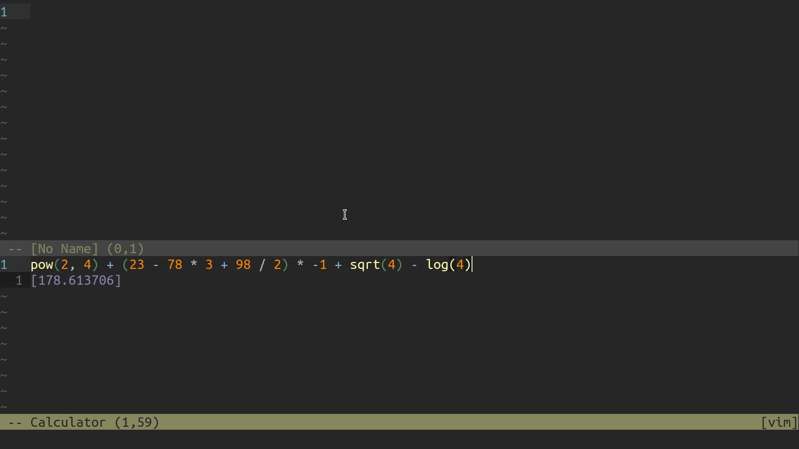
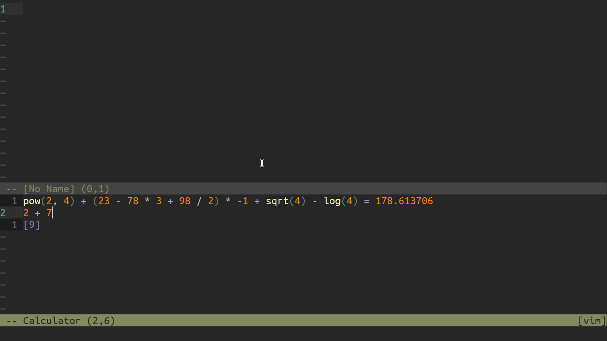

# `calc.vim`
A live calculator for Vim, meaning it evaluates expressions as they are typed. This was created because `bc` is not interactive enough for my tastes.



## Usage
```vim
:Calculator
```

## Accept an expression (`<CR>`)
Press `<CR>` to accept an expression, and create a new line for the next expression



## Exit
- `<C-c>` in Insert mode
- Exit vim, a.k.a. throw your computer from the top of Mt. Everest
